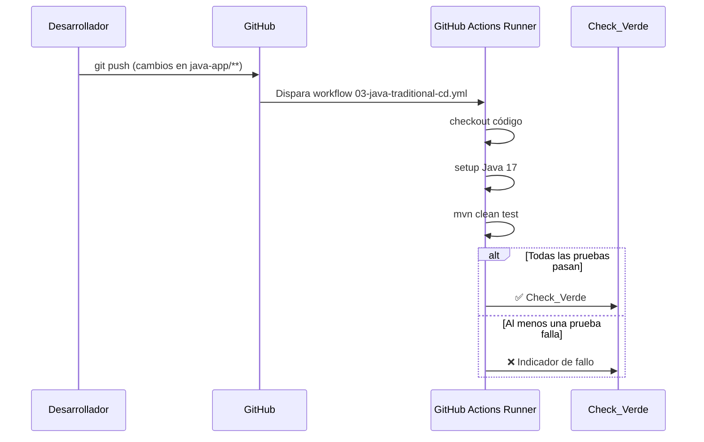

# Design Document — aws-despliegue101

## Overview

`aws-despliegue101` es un repositorio educativo que acompaña la charla "Despliegue 101" de Andrea Rosero. Su propósito es demostrar, de forma visual y práctica, que el proceso de Integración Continua (CI) sigue el mismo patrón independientemente del lenguaje de programación.

El repositorio contiene tres aplicaciones web equivalentes (Node.js/Express, Python/Flask y Java/Spring Boot) que exponen exactamente la misma interfaz HTML, más una variante Docker de la aplicación Java como bonus. Cada aplicación tiene su propio pipeline de GitHub Actions que ejecuta las pruebas automáticamente en cada push. La Fase 1 cubre únicamente CI (validación de calidad); el despliegue en AWS EC2 queda para fases posteriores, aunque los scripts de infraestructura ya se incluyen como referencia.

### Objetivos de diseño

- **Claridad pedagógica**: el código debe ser fácil de leer y entender por personas que están aprendiendo. Se priorizan comentarios explicativos sobre optimizaciones.
- **Uniformidad**: las tres aplicaciones deben ser estructuralmente paralelas para que la audiencia pueda comparar lenguajes lado a lado.
- **Reproducibilidad**: los pipelines deben funcionar de forma determinista en GitHub Actions sin configuración adicional.
- **Minimalismo**: cada aplicación hace exactamente lo necesario para la demo; no se añaden dependencias ni funcionalidades extra.

---

## Architecture

El repositorio sigue una arquitectura de **monorepo multi-aplicación** con pipelines independientes por tecnología.

```
aws-despliegue101/
├── .github/
│   └── workflows/
│       ├── 01-js-traditional-cd.yml       # Pipeline CI para JS
│       ├── 02-python-traditional-cd.yml   # Pipeline CI para Python
│       ├── 03-java-traditional-cd.yml     # Pipeline CI para Java
│       └── 04-java-docker-evolved-cd.yml  # Pipeline CI para Docker
├── 01-traditional-flow/
│   ├── javascript-app/
│   │   ├── src/
│   │   │   ├── server.js
│   │   │   └── public/
│   │   │       ├── index.html
│   │   │       └── style.css
│   │   ├── test/
│   │   │   └── app.test.js
│   │   └── package.json
│   ├── python-app/
│   │   ├── src/
│   │   │   ├── app.py
│   │   │   └── public/
│   │   │       ├── index.html
│   │   │       └── style.css
│   │   ├── test/
│   │   │   └── test_app.py
│   │   └── requirements.txt
│   └── java-app/
│       ├── src/
│       │   ├── main/
│       │   │   ├── java/com/andrea/devops/
│       │   │   │   └── Application.java
│       │   │   └── resources/
│       │   │       ├── application.properties
│       │   │       └── static/
│       │   │           ├── index.html
│       │   │           └── style.css
│       │   └── test/java/com/andrea/devops/
│       │       └── ApplicationTests.java
│       └── pom.xml
├── 02-docker-flow/
│   └── java-docker-app/
│       ├── (mismo código fuente que java-app)
│       └── Dockerfile
├── infra/
│   ├── ec2-js-setup.sh
│   ├── ec2-python-setup.sh
│   ├── ec2-java-setup.sh
│   └── ec2-docker-setup.sh
└── README.md
```

### Flujo de CI



El mismo patrón se repite para JS (Node.js + Jest) y Python (pytest), con los runners y comandos correspondientes a cada ecosistema.

---

## Components and Interfaces

### 1. Interfaz Web Unificada (`index.html` + `style.css`)

Componente HTML/CSS estático, idéntico en las tres aplicaciones. No tiene lógica de servidor; es servido como archivo estático.

**Contrato visual:**
- `<h1>` con texto exacto: `"Prueba de Despliegue Exitosa 🚀"`
- `<h2>` con texto exacto: `"Charla: Despliegue 101 - Por Andrea Rosero"`
- Botón/enlace: `"Ver Documentación del Repositorio"` → URL del repositorio en GitHub
- Fondo: degradado de `#1a1a2e` (gris muy oscuro) a `#16213e` / `#0f3460` (azul medianoche/violeta profundo)
- Tipografía: `Inter` o `Roboto`, centrada con Flexbox
- Responsive: breakpoints para escritorio, tablet (≤768px) y móvil (≤480px)
- Transición `hover` en el botón (transform + box-shadow)
- CSS en archivo separado `style.css`

### 2. Aplicación JavaScript — `src/server.js`

**Runtime:** Node.js 20 + Express

**Rutas:**
| Ruta | Método | Respuesta |
|------|--------|-----------|
| `/` | GET | Sirve `src/public/index.html` (archivos estáticos) |
| `/health` | GET | `{ "status": "UP", "charla": "Despliegue 101 con JavaScript" }` — HTTP 200 |

**Configuración de puerto:**
```
PORT = process.env.PORT ?? 80
```

**Pruebas:** `test/app.test.js` con Jest + Supertest — valida `/health` → HTTP 200.

### 3. Aplicación Python — `src/app.py`

**Runtime:** Python 3.11 + Flask

**Rutas:**
| Ruta | Método | Respuesta |
|------|--------|-----------|
| `/` | GET | Sirve `src/public/index.html` |
| `/health` | GET | `{ "status": "UP", "charla": "Despliegue 101 on Python" }` — HTTP 200 |

**Configuración de puerto:**
```python
port = int(os.environ.get("PORT", 80))
```

**Pruebas:** `test/test_app.py` con pytest + pytest-flask — valida `/health` → HTTP 200.

### 4. Aplicación Java — Spring Boot 3

**Runtime:** Java 17 + Spring Boot 3

**Rutas:**
| Ruta | Método | Respuesta |
|------|--------|-----------|
| `/` | GET | Sirve `src/main/resources/static/index.html` |
| `/health` | GET | `{ "status": "UP", "charla": "Despliegue 101 con Java" }` — HTTP 200, `Content-Type: application/json` |

**Configuración:** `application.properties` → `server.port=80`

**Clases principales:**
- `Application.java` — clase principal con `@SpringBootApplication` y `main()`
- `HealthController.java` — `@RestController` con `@GetMapping("/health")`

**Pruebas:** `ApplicationTests.java` con `@SpringBootTest` — valida carga del contexto y `/health` → HTTP 200.

### 5. Aplicación Java con Docker — `Dockerfile`

**Estrategia multi-etapa:**
```
Etapa 1 (build): maven:3.9-eclipse-temurin-17 → mvn package -DskipTests
Etapa 2 (runtime): eclipse-temurin:17-jre → copia el JAR y lo ejecuta
```

**Puerto expuesto:** `8080` (convención Docker; difiere del `80` del flujo tradicional para ilustrar la diferencia).

**Código fuente:** reutiliza exactamente el mismo código de `java-app/` sin modificaciones.

### 6. Pipelines de GitHub Actions

Cada pipeline sigue la misma estructura lógica:

```yaml
on:
  push:
    paths:
      - '<ruta-de-la-app>/**'

jobs:
  control-de-calidad:
    runs-on: ubuntu-latest
    steps:
      - uses: actions/checkout@v4
      - name: Configurar <runtime>
        uses: actions/setup-<runtime>@v<N>
        with: { version: '<versión>' }
      - name: Instalar dependencias
        run: <comando-instalación>
      - name: Ejecutar pruebas
        run: <comando-test>
```

| Pipeline | Path trigger | Runtime action | Comando de pruebas |
|----------|-------------|----------------|--------------------|
| `01-js-traditional-cd.yml` | `01-traditional-flow/javascript-app/**` | `actions/setup-node@v4` (Node 20) | `npm test --prefix 01-traditional-flow/javascript-app` |
| `02-python-traditional-cd.yml` | `01-traditional-flow/python-app/**` | `actions/setup-python@v5` (Python 3.11) | `pytest 01-traditional-flow/python-app/test/` |
| `03-java-traditional-cd.yml` | `01-traditional-flow/java-app/**` | `actions/setup-java@v4` (Java 17, Temurin) | `mvn -f 01-traditional-flow/java-app/pom.xml clean test` |
| `04-java-docker-evolved-cd.yml` | `02-docker-flow/java-docker-app/**` | — (Docker preinstalado en ubuntu-latest) | `docker build ./02-docker-flow/java-docker-app` |

### 7. Scripts de Infraestructura EC2 (`infra/`)

Scripts de shell idempotentes (bash) para preparar instancias EC2 Amazon Linux 2 / Ubuntu. Cada script:
1. Actualiza el sistema (`yum update` / `apt-get update`)
2. Instala el runtime correspondiente
3. Clona el repositorio
4. Configura la aplicación como servicio systemd (o contenedor Docker)
5. Habilita e inicia el servicio

**Idempotencia:** cada paso verifica si ya está instalado/configurado antes de actuar (uso de `command -v`, `systemctl is-enabled`, etc.).

---

## Data Models

### Health Response (compartido por las tres aplicaciones)

```json
{
  "status": "UP",
  "charla": "Despliegue 101"
}
```

| Campo | Tipo | Valor fijo | Descripción |
|-------|------|-----------|-------------|
| `status` | string | `"UP"` | Estado del servicio |
| `charla` | string | `"Despliegue 101"` | Identificador de la charla |

### Configuración de entorno (por aplicación)

| Variable | Tipo | Default | Descripción |
|----------|------|---------|-------------|
| `PORT` | integer | `80` | Puerto en que escucha la aplicación (JS y Python) |

La Java_App no usa variable de entorno para el puerto en Fase 1; el valor está fijado en `application.properties`.

### Estructura de `package.json` (JS_App)

```json
{
  "name": "javascript-app",
  "version": "1.0.0",
  "scripts": {
    "start": "node src/server.js",
    "test": "jest"
  },
  "dependencies": {
    "express": "<versión fijada>"
  },
  "devDependencies": {
    "jest": "<versión fijada>",
    "supertest": "<versión fijada>"
  }
}
```

### Estructura de `requirements.txt` (Python_App)

```
Flask==<versión fijada>
pytest==<versión fijada>
pytest-flask==<versión fijada>
```

### Estructura de `pom.xml` (Java_App)

Dependencias clave:
- `spring-boot-starter-web` — servidor web embebido (Tomcat)
- `spring-boot-starter-test` — JUnit 5 + Spring Test
- Java source/target: `17`
- Spring Boot parent: `3.x.x`

---

## Error Handling

### Aplicaciones web (JS, Python, Java)

| Escenario | Comportamiento esperado |
|-----------|------------------------|
| Puerto ya en uso al arrancar | La aplicación falla con mensaje de error claro en stderr y código de salida distinto de 0. No se intenta recuperar automáticamente (fuera del alcance de Fase 1). |
| Variable `PORT` con valor no numérico | JS y Python deben fallar con error descriptivo. Java usa `application.properties` fijo, por lo que no aplica. |
| Ruta no encontrada (404) | Express / Flask / Spring Boot retornan su respuesta 404 por defecto. No se requiere página de error personalizada en Fase 1. |
| Archivo estático no encontrado | El servidor retorna 404. El archivo `index.html` debe estar presente en la ruta correcta; si no, es un error de empaquetado que se detecta en CI. |

### Pipelines de GitHub Actions

| Escenario | Comportamiento esperado |
|-----------|------------------------|
| Fallo en `mvn clean test` / `npm test` / `pytest` | El step falla, el job `control-de-calidad` falla, el pipeline produce indicador de fallo (❌). GitHub notifica al autor del push. |
| Fallo en `docker build` | El step falla, el pipeline produce indicador de fallo. |
| Timeout del runner (6 horas por defecto en GitHub Actions) | El job se cancela automáticamente. Para Fase 1 esto no debería ocurrir dado el alcance mínimo de las pruebas. |
| Push que no afecta los paths configurados | El pipeline no se activa (filtro `paths:`). Comportamiento correcto y esperado. |

### Scripts de Infraestructura EC2

| Escenario | Comportamiento esperado |
|-----------|------------------------|
| Script ejecutado por segunda vez | Cada paso verifica si ya está instalado/configurado antes de actuar. El script completa sin errores ni duplicaciones. |
| Fallo en la instalación de dependencias | El script falla en ese paso con mensaje de error. No continúa a pasos posteriores (comportamiento por defecto de `set -e`). |
| Repositorio ya clonado | El script verifica si el directorio existe antes de clonar; si existe, hace `git pull` en su lugar. |

### Dockerfile

| Escenario | Comportamiento esperado |
|-----------|------------------------|
| Fallo en `mvn package` durante el build | `docker build` falla con código de salida distinto de 0. El pipeline de Docker produce indicador de fallo. |
| JAR no encontrado en la etapa final | El `COPY` falla y `docker build` retorna error. |

---

## Testing Strategy

### Evaluación de Property-Based Testing (PBT)

Tras el análisis de los criterios de aceptación, **PBT no es aplicable** a este feature. Las razones son:

1. **El repositorio es principalmente configuración e IaC**: los pipelines de GitHub Actions, el Dockerfile y los scripts de EC2 son configuración declarativa, no funciones con lógica de entrada/salida variable.
2. **Las aplicaciones web son triviales**: los endpoints `/health` siempre retornan la misma respuesta fija. No hay lógica de transformación de datos que se beneficie de 100+ iteraciones con inputs aleatorios.
3. **Los checks de estructura son deterministas**: verificar que un archivo existe o que un campo JSON tiene un valor fijo no varía con el input.
4. **Los comportamientos de CI son externos**: el Check_Verde lo produce GitHub Actions, no nuestro código.

Por estas razones, la sección de Correctness Properties se omite y la estrategia de testing se basa en pruebas de ejemplo e integración.

---

### Estrategia de Testing por Capa

#### 1. Pruebas unitarias / de ejemplo (incluidas en el repositorio)

Estas pruebas son parte del código fuente de cada aplicación y son ejecutadas por los pipelines de CI.

**JavaScript — `test/app.test.js` (Jest + Supertest)**
```javascript
// Prueba 1: Health endpoint retorna HTTP 200
// Prueba 2: Health endpoint retorna JSON con status=UP y charla=Despliegue 101
```

**Python — `test/test_app.py` (pytest + pytest-flask)**
```python
# Prueba 1: Health endpoint retorna HTTP 200
# Prueba 2: Health endpoint retorna JSON con status=UP y charla=Despliegue 101
```

**Java — `ApplicationTests.java` (@SpringBootTest + MockMvc)**
```java
// Prueba 1: El contexto de Spring carga correctamente
// Prueba 2: GET /health retorna HTTP 200
// Prueba 3: GET /health retorna Content-Type application/json
// Prueba 4: GET /health retorna body con status=UP y charla=Despliegue 101
```

Cada prueba incluye comentarios educativos que explican su propósito y su relación con el Check_Verde de GitHub Actions.

#### 2. Pruebas de smoke (verificación de estructura)

Estas verificaciones pueden hacerse manualmente o con un script de validación del repositorio:

- Verificar que todas las carpetas y archivos requeridos existen (Req. 1)
- Verificar que `index.html` contiene los textos exactos requeridos (Req. 2.1–2.3)
- Verificar que `style.css` existe como archivo separado (Req. 2.7)
- Verificar que los YAML de los pipelines contienen los paths, jobs y steps correctos (Req. 7–9)
- Verificar que los scripts de EC2 contienen comentarios en español (Req. 10.5)

#### 3. Pruebas de integración (verificación end-to-end)

Estas pruebas requieren un entorno de ejecución real:

| Prueba | Cómo ejecutar | Criterio de éxito |
|--------|--------------|-------------------|
| Pipeline JS completo | Push a `javascript-app/**` | Check_Verde en GitHub |
| Pipeline Python completo | Push a `python-app/**` | Check_Verde en GitHub |
| Pipeline Java completo | Push a `java-app/**` | Check_Verde en GitHub |
| Pipeline Docker completo | Push a `java-docker-app/**` | Check_Verde en GitHub |
| Demo en vivo (Req. 11) | Cambio menor en CSS + push | Check_Verde en < 3 minutos |
| Docker run local | `docker build` + `docker run` | GET / y GET /health → HTTP 200 |

#### 4. Verificación de idempotencia de scripts EC2

Para verificar el Req. 10.6, se puede usar una instancia EC2 de prueba:
1. Ejecutar el script por primera vez → verificar que el servicio arranca correctamente
2. Ejecutar el script por segunda vez → verificar que no hay errores ni duplicaciones
3. Verificar que el servicio sigue funcionando tras la segunda ejecución

#### 5. Verificación de equivalencia visual (Req. 2.9)

Para confirmar que las tres aplicaciones sirven la misma interfaz:
1. Arrancar las tres aplicaciones en puertos distintos (3001, 3002, 3003)
2. Hacer GET / a cada una
3. Comparar el contenido HTML retornado — debe ser idéntico

---

### Resumen de cobertura por Requirement

| Requirement | Tipo de test | Automatizable en CI |
|-------------|-------------|---------------------|
| Req. 1 — Estructura del repositorio | Smoke | Sí (script de validación) |
| Req. 2 — Interfaz Web Unificada | Ejemplo + Smoke | Parcialmente (contenido HTML sí, visual no) |
| Req. 3 — JS App | Ejemplo (incluido en repo) | Sí (npm test) |
| Req. 4 — Python App | Ejemplo (incluido en repo) | Sí (pytest) |
| Req. 5 — Java App | Ejemplo (incluido en repo) | Sí (mvn test) |
| Req. 6 — Docker App | Integración | Sí (docker build en CI) |
| Req. 7 — Pipeline Java | Smoke + Integración | Smoke sí; integración requiere GitHub |
| Req. 8 — Pipelines JS y Python | Smoke + Integración | Smoke sí; integración requiere GitHub |
| Req. 9 — Pipeline Docker | Smoke + Integración | Smoke sí; integración requiere GitHub |
| Req. 10 — Scripts EC2 | Smoke + Integración | Smoke sí; idempotencia requiere EC2 |
| Req. 11 — Demo en vivo | Integración | Requiere GitHub (demo manual) |
